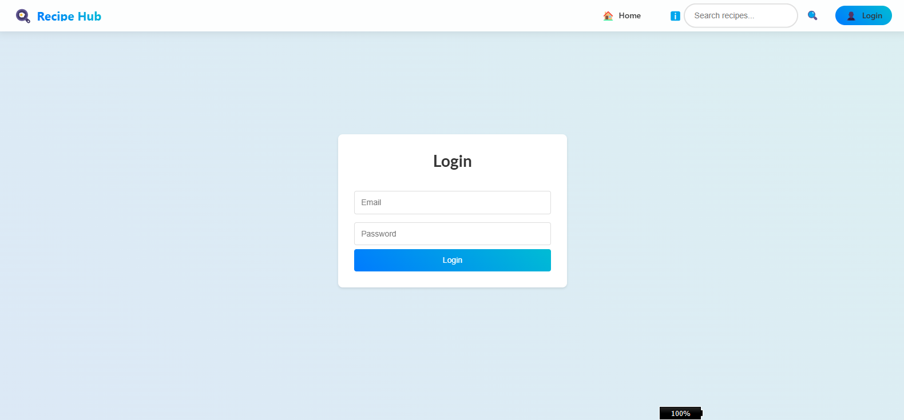
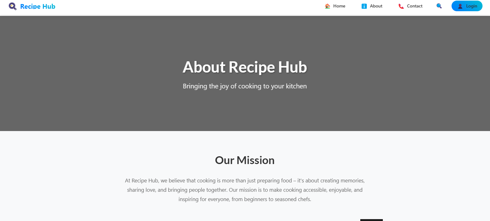
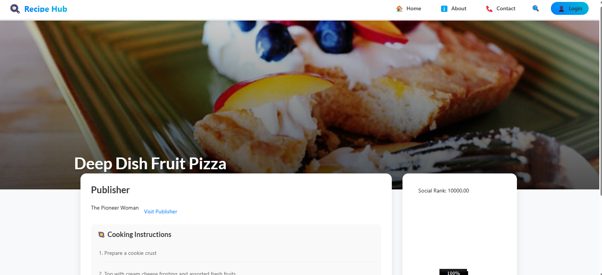
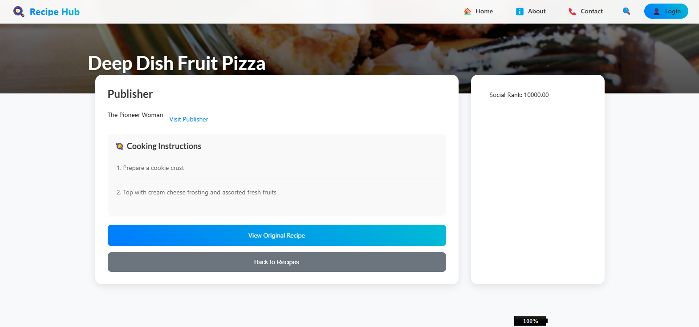
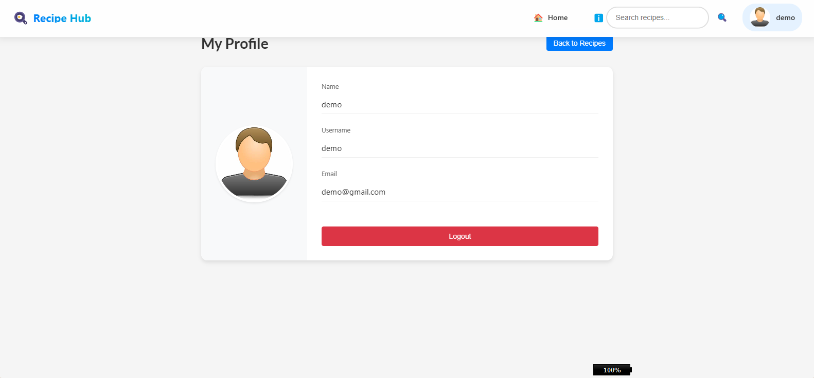

      <h1>  Recipe Hub</h1>

    
    
    

# Tech Used

A modern recipe sharing platform built with React and Firebase, featuring recipe management, user authentication, and admin capabilities.

## 🔴 Live Demo

Check out the live demo: [https://recipe-finder-jamalihassan0307.web.app](https://recipe-finder-jamalihassan0307.web.app)

### Demo Credentials

#### Admin Access

- **Email:** admin@gmail.com
- **Password:** admin
- **Role:** Administrator

#### User Access

- **Email:** demo@gmail.com
- **Password:** 1234
- **Role:** Regular User

_Feel free to use these credentials to explore different features of the application_

## 📸 Screenshots

### User Journey

#### 1. Home Page

_Landing page showcasing featured recipes_

#### 2. Authentication

_Secure user authentication interface_

#### 3. About Page

_Information about Recipe Hub and team_

#### 4. Contact Page

_Contact information and support_

### Admin Features

#### 5. Admin Dashboard

_Admin interface for managing recipes_

#### 6. Add Recipe

_Interface for adding new recipes_

#### 7. Edit Recipe

_Edit existing recipes_

### User Features

#### 8. User Home

_User dashboard with personalized content_

#### 9. View Recipe

_Detailed recipe view with instructions_

#### 10. Profile Management

_User profile management_

## 🚀 Features

- **User Authentication**

  - Secure login system
  - Role-based access control (Admin/User)
  - Protected routes

- **Recipe Management**

  - Browse recipe listings
  - Search recipes
  - Add new recipes (Admin)
  - Edit existing recipes (Admin)
  - Delete recipes (Admin)

- **User Interface**

  - Responsive design
  - Modern UI with Semantic UI
  - Interactive components

- **Profile Management**
  - User profile viewing
  - Profile editing
  - Role-based permissions

## 🛠️ Built With

- **Frontend Framework**

  - React.js
  - Semantic UI React

- **Styling**

  - Semantic UI CSS
  - Custom CSS

- **State Management & Routing**

  - React Router DOM
  - Local Storage

- **Backend & Hosting**

  - Firebase Hosting
  - Firebase Authentication

- **Additional Libraries**
  - Axios (API calls)

## 🚀 Getting Started

1. Clone the repository

## 🙏 Acknowledgments

- [React](https://reactjs.org/)
- [Firebase](https://firebase.google.com/)
- [Semantic UI React](https://react.semantic-ui.com/)

## 📝 License

This project is licensed under the MIT License - see the [LICENSE.md](LICENSE.md) file for details.
